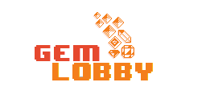

# 
TFM Game
# Gems-Lobbies
> Juego de tiros en dos dimensiones que explota las posibilidades de los Tower Defense sin olvidarse de reventar un par de enemigos por el camino..

[![Build Status][travis-image]][travis-url]

## ¿Cuando estara listo?

La version Alpha esta ya lista.
[Itch.io](https://satiring.itch.io/gemlobby)

A disfrutar mientras sigo añadiendo contenido.

## Existe Documentacion

Si, Notion MADAFACA.

[Notion GDD Active Document](https://www.notion.so/satiring/Gem-Lobby-93927a6cd1f441e78ad13ffa1f763abf)

** El documento esta constantemente actualizandose.

## ¿Que debo esperar?

Ahora mismo estan las cosas calentitas, asique esta guay que me des tu feedback.

## ¿Quienes lo estamos haciendo?

@Satiring & Eliboo

## Historial de versiones

* 0.5
    * ALPHA VERSION
* 0.0.2
    * Trabajo aun mas en progreso
* 0.0.1
    * Trabajo en progreso

## Meta

Jose Angel – [@Satiring](https://twitter.com/Satiring) – escuelaps@gmail.com

[https://github.com/Satiring/GemLobby] - (This repo.)

[travis-image]: https://img.shields.io/travis/dbader/node-datadog-metrics/master.svg?style=flat-square
[travis-url]: https://travis-ci.org/dbader/node-datadog-metrics